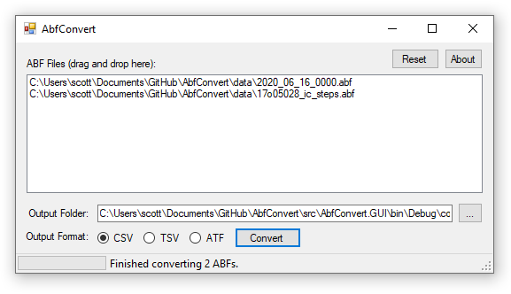

# AbfConvert

**AbfConvert converts Axon Binary Format (ABF) files to ATF, CSV, and TSV formats.** AbfConvert uses Axon's official DLL to read ABF files, so it supports ABF1 and ABF2 file formats.

### Download at the AbfConvert Website
https://swharden.com/software/AbfConvert/
