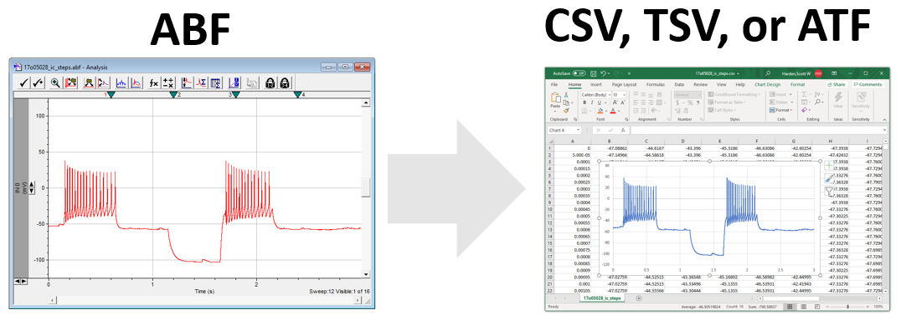

# AbfConvert

**AbfConvert makes it easy to convert Axon Binary Format (ABF) files to ATF, CSV, and TSV formats.** AbfConvert uses Axon's official DLL to read ABF files, so it supports ABF1 and ABF2 file formats.



### Screenshot


### Download

* **[AbfConvert-1.1.zip](https://github.com/swharden/AbfConvert/releases/download/1.1/AbfConvert-1.1.zip)**

### Features

* **Convert ABF to CSV** for easy analysis in programs like Excel.

* **Convert to ABF to ATF** for analysis in legacy analysis software which does not support the latest ABF file formats.

* **Batch convert** entire directories of folders by supplying folders (instead of individual ABF files) as input and output parameters.

### Command Line Utility

A command line utility is also available which may be useful for those interested in automated conversion of ABF files in complex directory structures.

```
AbfConverter.exe [input] [output] [format]
```

* input: path to an ABF file or a folder of ABF files
* output: path to the output file or folder
* format: CSV, TSV, or ATF
